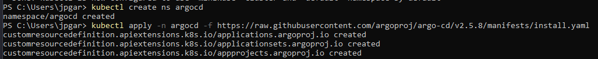

## Gitops para automatizar cambios

Haremos uso de ArgoCD y minikube para automatizar cambios en nuestro deployments y en cualquier otro archivo yaml.

Como primer paso iniciaremos un clúster de minikube:
```
minikube start
```

Luego crearemos un manifiesto de kubernetes, en este caso el archivo app-deploy.yaml

### Configuración argo
<picture>
  
</picture>

- Creamos un nombre para argocd y lo instalamos

Luego con el comando
```
kubectl config use-context minikube
```
establecerá el contexto de kubectl para apuntar al clúster de Minikube.


Si kubectl config current-context devuelve un error indicando que el "current-context" no está configurado, eso significa que aún no has configurado un contexto en tu cliente kubectl.

Para configurar el contexto de Minikube, puedes utilizar el siguiente comando:
```
kubectl config set-context minikube --cluster=minikube --user=minikube

kubectl config use-context minikube
```


Estos comandos establecerán el contexto de kubectl para apuntar al clúster de Minikube. Luego, puedes verificar nuevamente el contexto actual nuevamente con: kubectl config current-context

<picture>
  
</picture>

Para proseguir ejecutamos el siguiente conmando:
```
kubectl port-forward svc/argocd-server -n argocd 8080:443
```
con el cual habrás configurado un túnel local que redirige el tráfico desde tu máquina local al servicio argocd-server en el clúster de Kubernetes.

<picture>
  
</picture>

Ahora, para acceder al tablero de ArgoCD, ve a la dirección:

http://localhost:8080


Deberías visualizar lo siguiente:
<picture>
  
</picture>
en el cual el usuario por defecto es admin y la contraseña la podemos encontrar ejecutando el comando:
```
kubectl -n argocd get secret argocd-initial-admin-secret -o=jsonpath="{.data.password}" | base64 --decode
```

Luego procedes a conectar el repo:
<picture>
  
</picture>


Y como último paso la creación de una app:
<picture>
  
</picture>

# Observar cambios:
Realiza cambios en tu archivo YAML (puedes cambiar la etiqueta de la imagen, por ejemplo).
Haz un commit y un push a tu repositorio de Git.
En el tablero de ArgoCD, selecciona la aplicación y haz clic en "Sincronizar".
ArgoCD detectará automáticamente los cambios en tu repositorio y aplicará los despliegues correspondientes en tu clúster Minikube.
